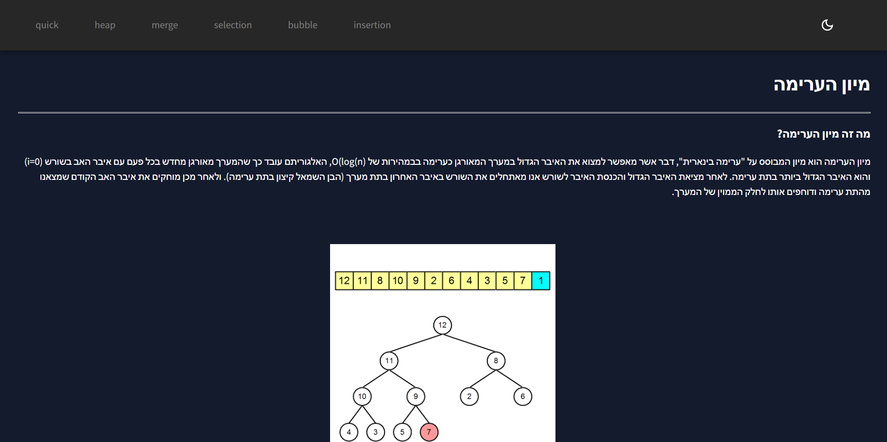
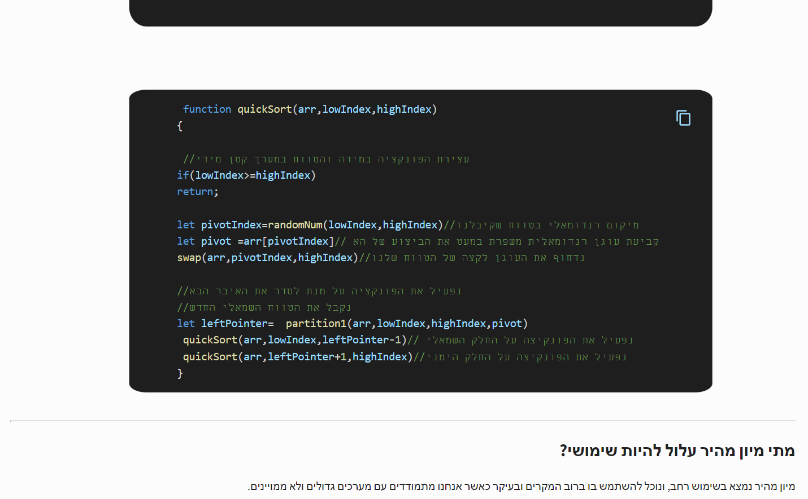
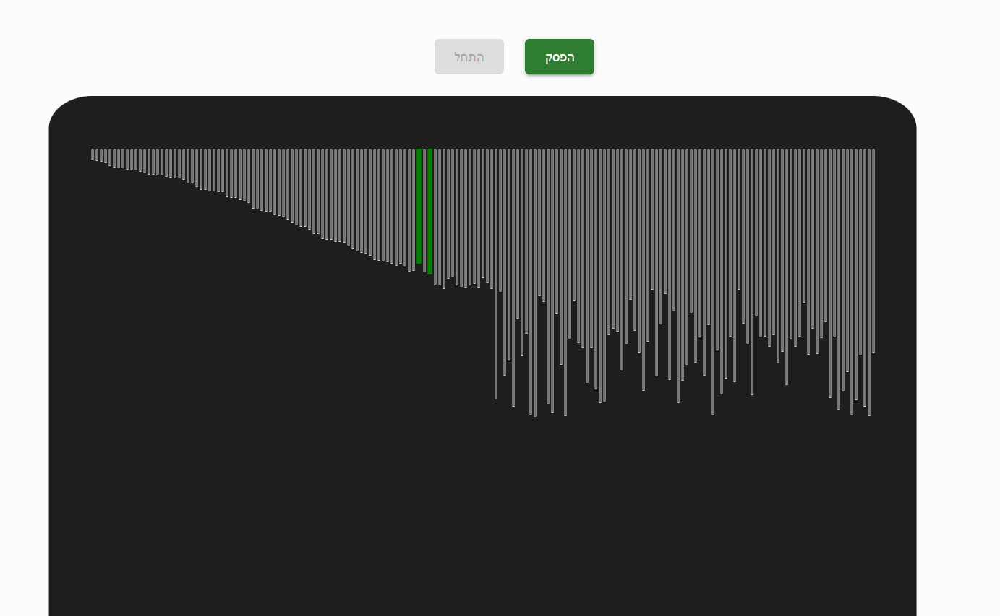

## About the project
sorts.co.il is an educational platform that lets the user learn about sorting algorithms
and provides a visual implementation of the algorithm.

## Running the project

1. Clone the repo.
2. Run `npm install`.
3. enter the server folder.
4. run `nodemon server.js`.
5. go back to the root folder.
6. Run `npm start`.
7. Navigate to `http://localhost:3000`.

## Technologies:

### Client-side:
* React.JS
* mui

## What's next:
1. improve overall user interface.
3. add more sorts. 
3. add path finding section.
4. add general section about cs topics.

 Dark mode about section 

 Light mode

Item bids section

